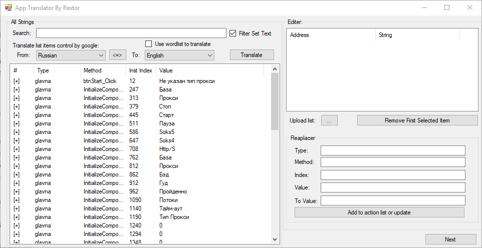
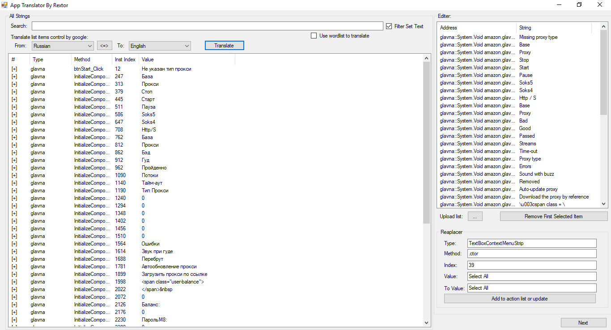
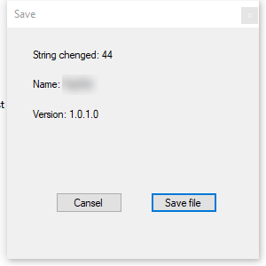

# AppTranslator
Translate any dot net application by google translator
- Analize Strings 

- Translate by google translator

- Save new exe file

# How to use
Just open the dot net application and filter set texts and tranlate manule or use google translator bot
# How to build
Just add dnlib to refrences and compile it
# How it work
This app just analize strings (ldstr opcode) and check it for review to user (Set text controls and message boxes) then you can translate it in reaplacer
# Credit
dnlib by 0xd4d
